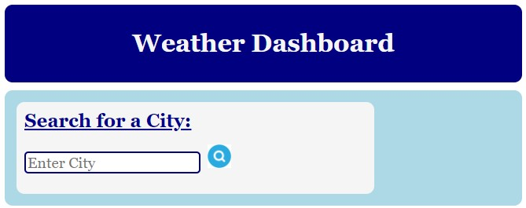
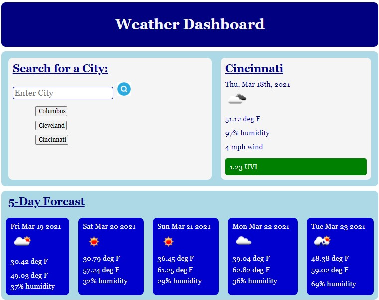

This Weather Dashboard shows the current weather and five-day forecast for cities.

The user can input the name of the city. 

After the user inputs the name of a city, it is added to a list.

Any city from the list may be selected as a search input.

The current weather includes:
City
Date
Weather Icon
Temperature (Fahrenheit)
Humidity
Wind Speed (mph)
Ultraviolet Index (with color coded alert bands)

The five-day forcast includes:
Date
Weather Icon
Minimum Temperature
Maximum Temperature
Humidity

The application can be found at the following website: https://rebecca-diroll.github.io/06-Weather/

